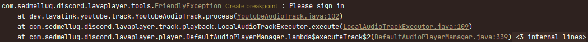
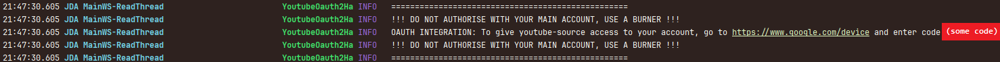
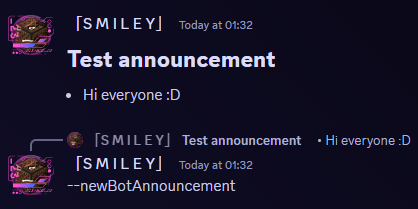

<h1>My discord bot :D</h1>

This repository is the source code for my discord bot.

The code is designed to be easily runnable on any bot account that has a stored token file.
A token file is a plain text file with a bot token inside it.

<h2>Getting started:</h2>

    These are the basic steps for setting up a working bot, and are also the only required steps for a working bot. 

<h3>Requires:</h3>
<ul>
    <li>Bot account token</li>
    <li>Java 21 (v1.6.0+)</li>
    <li>Java 17 (v1.0.0 - v1.5.4)</li>
</ul>
<h3>Setup steps (v1.7.0+):</h3>
<ol>
    <li>Go to <a href="https://github.com/SmileyFace799/discord-bot/releases">releases</a> & download a .jar file of the version you want. It is recommended to download the newest version</li>
    <li>Put the downloaded .jar / source code inside a designated bot folder</li>
    <li>Find & download the <a href="https://github.com/SmileyFace799/discord-bot/tree/master/Properties%20Templates/">.properties template</a>
    that corresponds to the release version of the bot you downloaded</li>
    <li>Put the .properties file inside your designated bot folder, and open it in a text editor</li>
    <li>Fill in "bot.[BOT_NAME] = [YOUR_BOT_TOKEN]" with a name for your bot, and its token
    (for example, "bot.mycoolbot = abcdefghijklmnopqrstuvwxyz"). If you have multiple bots, you can make an entry for each of them,
    for easy switching between multiple bot accounts </li>
    <li>Fill in "bot.active = [BOT_NAME]" with one of your bot names (case sensitive)
    (for example, "bot.active = mycoolbot"). This is the bot account that the bot script will run on</li>
    <li>If done correctly, the bot is now runnable. Upon running, it should print "[BOT_NAME] is ready" in the console</li>
</ol>
<h3>Setup steps (v1.0.0 - v1.6.4):</h3>
<ol>
    <li>Go to <a href="https://github.com/SmileyFace799/discord-bot/releases">releases</a> & download a .jar file of the version you want. It is recommended to download the newest version</li>
    <li>Put the downloaded .jar / source code inside a designated bot folder</li>
    <li>Create a folder named "tokens" (case-sensitive)</li>
    <li>Inside the newly created folder, create a text file named "{...}.token". Make sure the name is in all lowercase</li>
    <li>Open the newly created token file, and paste the bot's token inside it.</li>
    <li>Go back to the designated bot folder, and create a text file named "activeBot.txt" (case-sensitive)</li>
    <li>Open the newly created text file, and paste the name of the token file that should be used when starting the bot,
    without the ".token" file extension (case-insensitive)</li>
    <li>If done correctly, the bot is now runnable. Upon running, it should print "[BOT_NAME] is ready" in the console</li>
</ol>

<b>Note (v1.0.0):</b> The token file name in "activeBot.txt" is case-sensitive.

<h2>YouTube authentication (v1.8.1+)</h2>

    Sometimes, YouTube might flag your bot's request as "suspicious" and block your request,
    requiring your bot to "sign in" to access YouTube:

In this case, follow these steps to authenticate your bot:
<h3>Requires:</h3>
<ul>
    <li>A burner YouTube account (DO NOT USE AN ACCOUNT YOU CARE ABOUT, <b>IT CAN GET TERMINATED!</b>)</li>
</ul>
<h3>Setup steps:</h3>
<ol>
    <li>Run the bot as normal, play at least one track (does not matter if it succeeds or not)</li>
    <li>
        
Check your console output, you should see something like this:

        
    </li>
    <li>
        Click the link provided (<a href="https://www.google.com/device">https://www.google.com/device</a>)
        and enter the code you're given. Keep the bot running
    </li>
    <li>Follow the steps & connect the bot to your burner account</li>
    <li>If done correctly, there should now be a new message in your console with a long token (make sure the bot is still running)</li>
    <li>In your bot's .properties file, fill in "token.youtube.oauth = [YOUTUBE_OAUTH_TOKEN]" with the oauth token given in the last step</li>
    <li>That's it, your bot is now authenticated as the burner account you connected it to, and should no longer get blocked</li>
</ol>

<h2>Owner commands (v1.6.2+):</h2>

    As the bot owner, you have access to certain special "owner commands".
    These all use the `--[command]` syntax, and they are case-sensitive.

<ul>
    <li>
        

            `--newBotAnnouncement`: Reply to a message in your bot's private message channel with this command,
            and it will broadcast that message in every user who are subscribed to bot notifications
        

        

            Example usage (in private message channel with the bot): 
            
        

    </li>
</ul>

<h2>External APIs</h2>

The bot has support for some extra features through external APIs, but some of them do require setup

<h3>Parsing Spotify links (v1.2.0+):</h3>

    Spotify is a paid service, so the bot is not able to play music directly from spotify.
    However, the bot can parse info from a Spotify link, to then find & play the equivalent song(s) using a different service (currently YouTube).

<h4>Requires:</h4>
<ul>
    <li>Spotify client ID</li>
    <li>Spotify client secret</li>
</ul>
<h4>Setup steps (v1.7.0+)</h4>
<ol>
    <li>Open the .properties file</li>
    <li>Fill in "token.spotify.id = [SPOTIFY_CLIENT_ID]" with your spotify client ID (for example, "token.spotify.id = 5p071fycl13n71d")</li>
    <li>Fill in "token.spotify.secret = [SPOTIFY_CLIENT_SECRET]" with your spotify client secret (for example, "token.spotify.secret = 5p071fycl13n753cr37")</li>
</ol>
<h4>Setup steps (v1.2.0 - v1.6.4):</h4>
<ol>
    <li>Inside the "tokens"-folder, create a new file named "spotifyClient.sptoken" (case-sensitive)</li>
    <li>
        Inside the newly created Spotify token file, paste the following information:
        <ul>
            <li>Line 1: The Spotify client ID</li>
            <li>Line 2: The Spotify client secret</li>
        </ul>
    </li>
    <li>If done correctly, the bot should now be able to parse Spotify links</li>
</ol>

<h3>Parsing Deezer links (v1.7.0+):</h3>

    Deezer only allows playing 30-second extracts of their songs through their API.
    However, the bot can parse info from a Deezer link, to then find & play the equivalent song(s) using a different service (currently YouTube).

As the Deezer API currently doesn't require any authentication, support for this is enabled by default

<h3>Song lyrics with Genius (v1.8.0+):</h3>

    This does not actually use the Genius API, and instead uses an obscure library that scrapes a genius website for song lyrics.
    This means that no authentication is required, but if this ever breaks, the bot will switch to using the actual Genius API, which will require authentication

